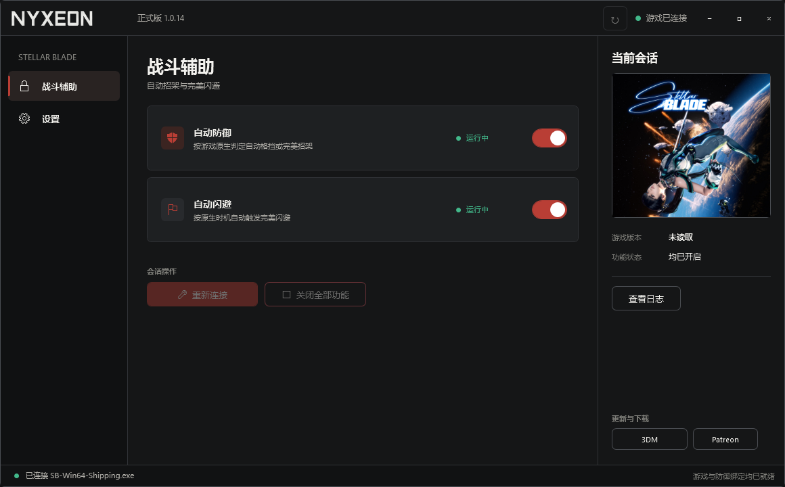

# Stellar Blade Combat Assistant

Official releases by Nyxeon (chenzilin100). Windows x64 - Steam Build 24463856.

[Download the latest release](https://github.com/chenzilin100/StellarBladeTrainer-Releases/releases/latest)

# Stellar Blade Trainer 1.0.3

`Combat Assistant - Auto Guard and Perfect Dodge` is a standalone Windows x64 trainer for Stellar Blade (Steam Build `24463856`). It is published by Nyxeon (`chenzilin100`).

## Highlights

- Two independent switches: automatic Guard/Parry and automatic Dodge.
- The trainer asks the game to judge the appropriate defensive action. Automatic Dodge is intended to use the game's native Perfect Dodge behavior when the game accepts it.
- When Blink or Repulse is already unlocked, the automatic Dodge feature can use the corresponding native blue or purple response. If the required skill is not unlocked, it falls back to ordinary Dodge. Fallback without Blink/Repulse has not been separately verified on a fresh save.
- 1.0.3 provides faster initialization when enabling features, based on the current build's startup measurements.
- Start the game or the trainer first; either order is supported. Once a switch is enabled, the trainer connects automatically.
- Turning both features off, or closing the trainer, cleans up its active session.
- Chinese and English UI, with light and dark themes.

## Requirements and use

- Windows x64.
- Steam Build `24463856` of Stellar Blade.
- The release is a self-contained EXE. No separate .NET, Python, or other runtime installation is required.
- Run the EXE outside the game directory. Vortex is not required, and no files need to be copied into the game directory.
- The trainer does not start the game for you. Use it only with a supported game build.

Open the trainer, confirm the detected game build, and enable either switch as needed. Keep only one trainer session connected to the game at a time.

## Scope

Results depend on the game's native action qualification and the current combat situation. The release does not claim damage immunity against every attack, coverage of every boss or encounter, or an FPS increase.

## Package

The public ZIP contains only the release EXE and this README. Development builds, source files, symbols, and diagnostic logs are not part of the public package.

Download: `https://github.com/chenzilin100/StellarBladeTrainer-Releases`

---

# 剑星 Trainer 1.0.3

`Combat Assistant - Auto Guard and Perfect Dodge` 是面向《剑星》（Stellar Blade，Steam Build `24463856`）的 Windows x64 独立修改器。作者：Nyxeon（`chenzilin100`）。

## 版本重点

- 两个独立开关：自动格挡/招架、自动闪避。
- 由游戏原生逻辑判断合适的防御动作。自动闪避会尝试触发游戏原生的完美闪避判定，最终结果仍由游戏当前状态决定。
- 已解锁 Blink 或 Repulse 技能时，自动闪避可以使用对应的原生蓝光或紫光应对；未解锁所需技能时回退为普通闪避。未解锁 Blink/Repulse 时的回退行为，尚未在新鲜存档上单独验证。
- 1.0.3 在开启功能时初始化更快；这是基于当前构建的启动测量结果。
- 可以先开游戏，也可以先开工具。开启开关后会自动连接。
- 关闭两个功能或退出工具后，会清理当前会话。
- 支持中文、English，以及明色和暗色主题。

## 使用条件

- Windows x64。
- 《剑星》Steam Build `24463856`。
- 发布版是自包含 EXE，不需要另外安装 .NET、Python 或其他运行环境。
- 请把 EXE 放在游戏目录之外运行。不需要 Vortex，也不需要把文件复制进游戏目录。
- 工具不会替你启动游戏；请只在支持的游戏构建上使用。

打开工具后确认已识别到正确的游戏构建，再按需要开启一个或两个开关。一次只保留一个 Trainer 会话连接到游戏。

## 功能范围

实际结果取决于游戏原生动作资格和当前战斗状态。本版本不声称可以对所有攻击实现无伤、不声称覆盖所有 Boss 或场景，也不声称提升 FPS。

## 发布包

公开 ZIP 只包含正式 EXE 和本说明文件。开发版、源码、符号文件和诊断日志不包含在公开包内。

下载：`[ROOT：填写 GitHub 仓库主页]`
