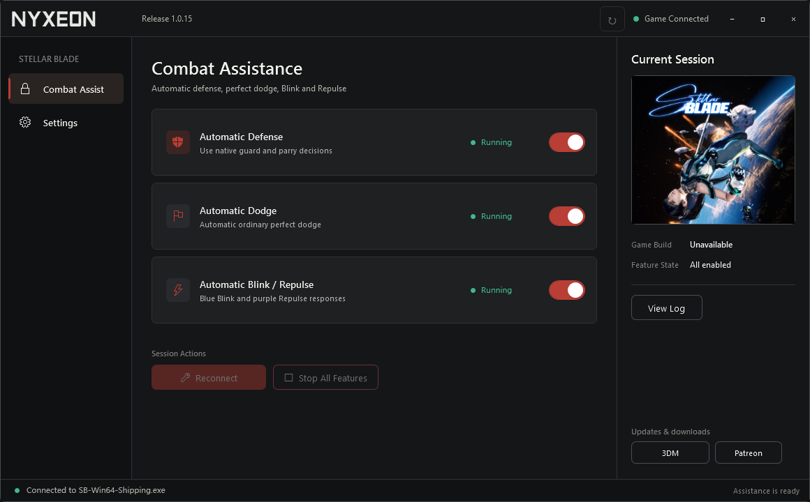

# Stellar Blade Combat Assistant

`StellarBladeTrainer.exe` is a standalone Windows x64 trainer for Stellar Blade (Steam Build `24463856`). It provides two independent combat-assistance switches:

- **Auto Guard** — automatic Guard and Perfect Parry when the game accepts the action.
- **Auto Dodge** — automatic Perfect Dodge assistance.

When Blink or Repulse is unlocked, Auto Dodge can use the corresponding blue or purple skill response. Those skills must be unlocked in the game before they can be used.

## Use

1. Download and extract the release ZIP.
2. Run `StellarBladeTrainer.exe` outside the game's installation directory.
3. Start Stellar Blade, or start the trainer first; either order is supported.
4. Enable Auto Guard, Auto Dodge, or both. The trainer connects automatically after a switch is enabled.

Turning both switches off or closing the trainer stops the assistance session. No Vortex setup or file copy into the game directory is required, and no separate .NET, Python, or other runtime installation is needed.

The interface supports English and Simplified Chinese, with light and dark themes. The trainer is intended for Steam Build `24463856`; a future game update may require a new compatible release.

Author: Nyxeon (`chenzilin100`)

[Download the release](https://github.com/chenzilin100/StellarBladeTrainer-Releases/releases/latest)

The download opens in English by default. Your language choice is saved after you change it in Settings.

